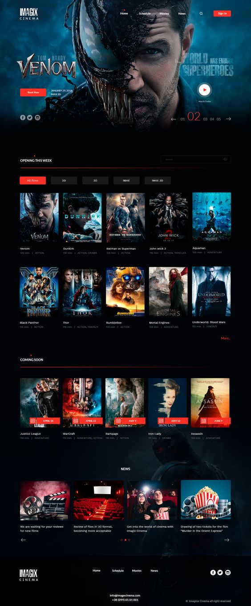

# DevMovies Website

This is a [Next.js](https://nextjs.org/) project bootstrapped with [`create-next-app`](https://github.com/vercel/next.js/tree/canary/packages/create-next-app).

## How I worked on this project

-  I built this app based on design inspiration with some variations
   
-  I fetched movies using the [The Movie Database (TMDB)](https://www.themoviedb.org/) API
-

## How to navigate this project

-  State management with Redux Toolkit [Example Code 1](https://github.com/ubong-s/dev-movies-nextjs-redux/blob/main/redux/store.js) [Example Code 2](https://github.com/ubong-s/dev-movies-nextjs-redux/tree/main/features)
-  Responsive CSS using styled-components [Example Code](https://github.com/ubong-s/dev-movies-nextjs-redux/blob/main/styles/globalStyle.js)
-  This application fetches data from the [The Movie Database (TMDB)](https://developers.themoviedb.org/3/getting-started/introduction) API

## Why I built the project this way

-  I used Redux for state management initially to improve my redux skills, then found out about Redux Toolkit and refactored my code to it
-  styled-components is a great library for styling. No class name bugs, easier deletion of CSS, simple dynamic styling and painless maintenance.What's not to love!!
-  I had to use an existing API because I can't create one of my own yet. I'm strictly on Frontend development but being a Fullstack developer is the goal.
-  Single Movie page data is fetched using the [Next.js](https://nextjs.org/) using `getServerSideProps`

## Improvements that can be made

-  Incorporate a testing library
-  Refactor the code to make it cleaner
