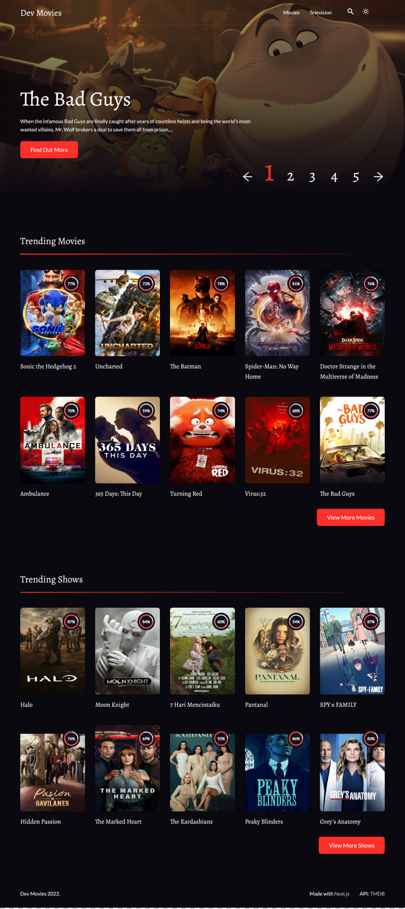

# DevMovies Website

Live Link [Dev Movies](https://dev-movies-nextjs-redux.vercel.app/)

This is a [Next.js](https://nextjs.org/) project bootstrapped with [`create-next-app`](https://github.com/vercel/next.js/tree/canary/packages/create-next-app).

## How I worked on this project

### Design

## How to navigate this project

-  State management with Redux Toolkit [Example Code 1](https://github.com/ubong-s/dev-movies-nextjs-redux/blob/main/redux/store.js) [Example Code 2](https://github.com/ubong-s/dev-movies-nextjs-redux/tree/main/features)
-  Responsive CSS using styled-components [Example Code](https://github.com/ubong-s/dev-movies-nextjs-redux/blob/main/styles/globalStyle.js)
-  This application fetches data from the [The Movie Database (TMDB)](https://developers.themoviedb.org/3/getting-started/introduction) API
-  Single Movie/TV page data is fetched using the [Next.js](https://nextjs.org/) using `getServerSideProps` [Example Code 1](https://github.com/ubong-s/dev-movies-nextjs-redux/blob/main/pages/tv/%5Bid%5D.js) [Example Code 2](https://github.com/ubong-s/dev-movies-nextjs-redux/blob/main/pages/movies/%5Bid%5D.js)

## Why I built the project this way

-  I used Redux for state management initially to improve my redux skills, then found out about Redux Toolkit and refactored my code to it
-  styled-components is a great library for styling. No class name bugs, easier deletion of CSS, simple dynamic styling and painless maintenance.What's not to love!!
-  I had to use an existing API because I can't create one of my own yet. I'm strictly on Frontend development but being a Fullstack developer is the goal.

## Improvements that can be made

-  Improve git commits and PR
-  Use a project management too to manage processes
-  Incorporate a testing library
-  Refactor the code to make it cleaner. Maybe Implement HOC to remove duplicate code [like this](https://github.com/ubong-s/dev-movies-nextjs-redux/blob/main/pages/movies/%5Bid%5D.js) and [this](https://github.com/ubong-s/dev-movies-nextjs-redux/blob/main/pages/tv/%5Bid%5D.js).
